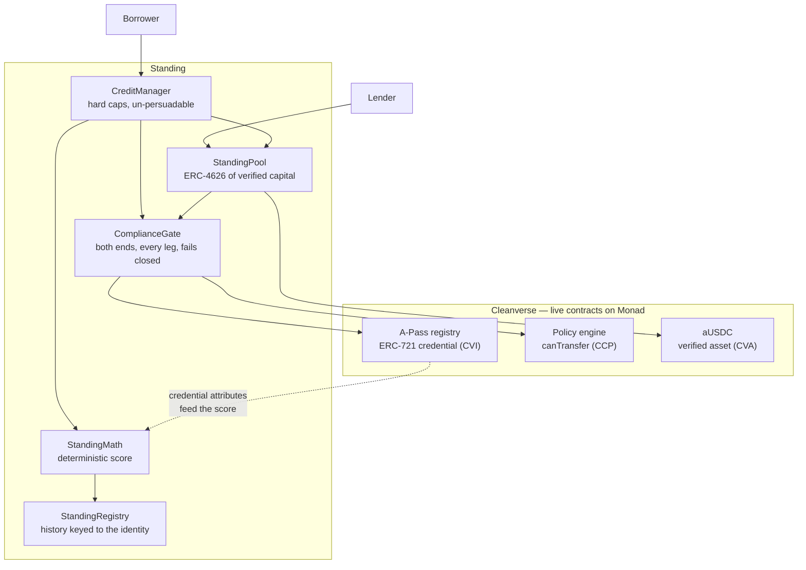

# Standing

**Under-collateralized credit, where the identity is the collateral.**

On-chain lending is stuck at over-collateralization. A pseudonymous wallet has nothing to lose, so
every protocol demands more value than it lends — which means you can only borrow if you already
own the money. That is not a credit market. It is leverage with extra steps.

Standing lends against a bank-verified identity instead. A Cleanverse A-Pass is not a badge the
protocol checks once at the door; it is the security behind the loan. Default, and the record is
written against the *identity* — not the wallet, not even the credential, but the person behind it —
and it follows them across wallets, across re-verifications, and across every other protocol that
consults the same compliance engine.

This is the one thing in DeFi that is impossible without verified identity. Not cheaper, not safer:
impossible. Remove Cleanverse and there is no recourse, so the loan has to be over-collateralized
again, and you are back where you started.

---

## The part that isn't in the docs

Cleanverse publishes a REST API and no ABI. Every integration guide has your *server* ask
`/query_apass` who a wallet belongs to, and `/validator/verify` whether a transfer is allowed. That
is fine for a payments backend and useless for a lending contract — a contract cannot call a REST
API, so a protocol built that way is trusting an off-chain relayer to tell the truth about identity
and about compliance.

So we went looking on-chain, and it is all there. A-Pass is an ERC-721 whose `tokenId` is the
holder's address and whose attributes are a public view. The compliance engine exposes
`canTransfer(token, from, to, amount)` — the same verdict `/validator/verify` returns, computed by
the same contract, callable from inside a transaction.

We recovered both interfaces from deployed bytecode and verified them against live state.
[`docs/CLEANVERSE.md`](docs/CLEANVERSE.md) documents what we found, how, and what we could not
establish. [`script/InspectCleanverse.s.sol`](contracts/script/InspectCleanverse.s.sol) reproduces
every claim in it against a live RPC, with no credentials:

```bash
cd contracts
forge script script/InspectCleanverse.s.sol --rpc-url https://testnet-rpc.monad.xyz
```

That is the difference between this and a protocol with a KYC gate bolted on. Compliance here is
not a precondition someone checked earlier. It is evaluated on-chain, inside the transaction that
moves the money, every time.

---

## How it works



**The score is arithmetic, not judgement.** `StandingMath` is a pure function of on-chain state:
the credential's tier, sub-tier and age; this protocol's own record of what the identity has repaid
and defaulted; and the borrower's verified-asset balance on a base-10 ladder. Same inputs, same
number, every time. The breakdown is returned in full so a borrower who is refused can see which
term refused them.

**The contract decides.** Above the score sit ceilings fixed at deployment — maximum principal,
maximum term, maximum rate, maximum line per identity — that no role and no signature can raise. An
operator can make the protocol stricter. Nobody can make it more generous.

**Every approved loan is under-collateralized.** The terms curve tops out at 80% collateral for the
weakest accepted borrower and falls to zero at the top. There is no point on it where you post more
than you borrow.

**Identity, not wallet.** Exposure and history are keyed to the A-Pass KYC hash. A second wallet is
the same borrower with the same line, already partly drawn. And because Cleanverse issues a *new*
hash when someone re-verifies, the registry unions the new hash into the old record — otherwise a
defaulter could launder their history by redoing KYC, which would make the whole premise unsound.

**The pool is itself a verified participant.** Cleanverse's policy engine checks both ends of a
transfer, and the pool is a party to every disbursement, so the pool contract holds its own A-Pass.
A verified-asset protocol should not be an anonymous intermediary standing between verified
counterparties.

---

## Deployed

Monad testnet (chain id 10143) — [see why testnet](#honest-limits).

| Contract | Address |
|---|---|
| `CreditManager` | [`0xC6E2aC49a18BfB71F2981efeaac2aC41Db1c1f74`](https://testnet.monadexplorer.com/address/0xC6E2aC49a18BfB71F2981efeaac2aC41Db1c1f74) |
| `StandingPool` | [`0x010263d8e3b2DC38F63A3f1660D2502f204ffB6D`](https://testnet.monadexplorer.com/address/0x010263d8e3b2DC38F63A3f1660D2502f204ffB6D) |
| `StandingRegistry` | [`0x2bD8832C9Bc98df47F256507a903B0338D96C0b5`](https://testnet.monadexplorer.com/address/0x2bD8832C9Bc98df47F256507a903B0338D96C0b5) |

Cleanverse contracts these bind to, unchanged and not ours:

| | Address |
|---|---|
| A-Pass registry (CVI) | `0xbA82D189540CaC9DC6FF46B6837CaC1BFdEC58B9` |
| Policy engine (CCP) | `0x36489bE45fa84f70a0c2BDB11D824Be608CB12Dd` |
| aUSDC (CVA) | `0xaC0893567D43C3E7e6e35a72803df05416C1f20D` |

---

## Run it

```bash
git clone <this repo> && cd standing-protocol

# contracts
cd contracts
forge install
forge test                                    # unit + invariant + fork
forge script script/InspectCleanverse.s.sol --rpc-url https://testnet-rpc.monad.xyz

# console
cd ../web
npm install
npm run dev                                   # http://localhost:3000
```

The console reads the live deployment. No API keys, no accounts, no seeded fixtures — every number
on the screen is read from the chain, including the zeroes.

To deploy your own instance:

```bash
cd contracts
PRIVATE_KEY=0x... forge script script/Deploy.s.sol:Deploy \
  --rpc-url https://testnet-rpc.monad.xyz --broadcast
```

| Variable | Default |
|---|---|
| `PRIVATE_KEY` | required |
| `APASS_REGISTRY` | `0xbA82D189540CaC9DC6FF46B6837CaC1BFdEC58B9` |
| `POLICY` | `0x36489bE45fa84f70a0c2BDB11D824Be608CB12Dd` |
| `VERIFIED_ASSET` | `0xaC0893567D43C3E7e6e35a72803df05416C1f20D` |

After deploying, the pool needs its own A-Pass (`POST /generate_apass` with the pool's address) or
the gate will — correctly — refuse everything.

---

## Honest limits

The protocol is only as good as what we can actually demonstrate, so:

- **Testnet, not mainnet.** Cleanverse's contracts are deployed at identical addresses on Monad
  mainnet, but sandbox credentials issue credentials into testnet only. Mainnet would mean a
  deployment bound to identities we cannot create.
- **The A-Pass attribute getter is bound by raw selector.** We have its selector, argument and
  return layout, all verified against live state and cross-checked against the REST API for the same
  wallet. We do not have its name, and the binding would break if Cleanverse changed the layout
  behind the proxy.
- **We do not decode the credential's country list.** Word 9 of the record is populated but we could
  not confirm its packing well enough to read it safely. Jurisdiction is enforced the right way round
  anyway — through `canTransfer`, where Cleanverse applies its own country rules.
- **A rogue `CREDIT_MANAGER_ROLE` could drain the pool.** The role is granted once, at deployment, to
  the credit manager. The pool retains an admin who could grant it again. This is a real trust
  assumption and we are not going to pretend otherwise.
- **Donations move the share price.** `totalAssets` reads the vault's balance, so anyone can transfer
  assets in. There is a 6-decimal virtual offset against first-depositor griefing, but the surface
  exists.

[`CLAIMS.md`](CLAIMS.md) states every claim this README makes with the evidence tier behind it, and
lists what we are explicitly *not* claiming.

---

## Layout

```
contracts/
  src/
    ComplianceGate.sol         both ends, every leg, fails closed
    CreditManager.sol          origination, servicing, write-offs, hard caps
    StandingPool.sol           ERC-4626 vault of verified capital
    StandingRegistry.sol       credit history keyed to identity, with union-find
    libraries/
      ApassReader.sol          decodes the on-chain credential
      StandingMath.sol         the score and the terms curve
    interfaces/ICleanverse.sol recovered Cleanverse interfaces
  script/
    Deploy.s.sol
    InspectCleanverse.s.sol    reproduces every claim in docs/CLEANVERSE.md
  test/                        unit, invariant and forked-network suites
web/                           the console
docs/CLEANVERSE.md             the on-chain surface of the Cleanverse stack
```

MIT.
